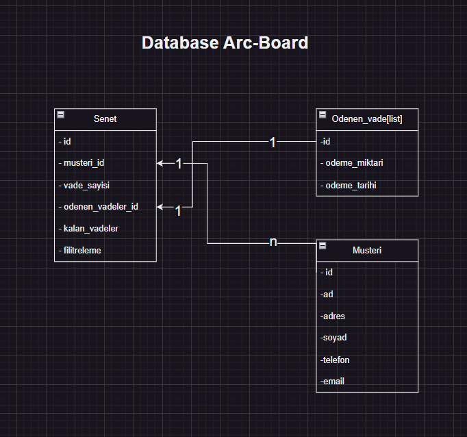

<h1 align="center">
  Promissory Note Tracking API 💵🤑
</h1>

### About Project

Promissory note tracking API is a web API that provides you an opportunity to take notes, and track your account or business budget. You can also discover what kind of promissory note and how much debt you have, how much you need to pay as well as how much is already paid.

### Project Functionality and Structure

This project takes guidelines and pointers from SOLID principles and includes them in all steps to create the most effective output possible.

### Application Properties

- Php
- Php Laravel
- Mysql
- Html,Css,Bootstrap5.

## DB Tables

## Project Physical Appearance
 
 

